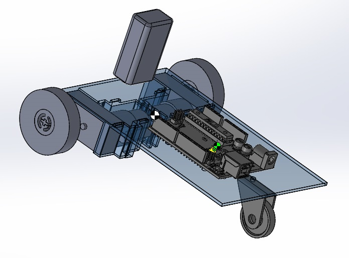
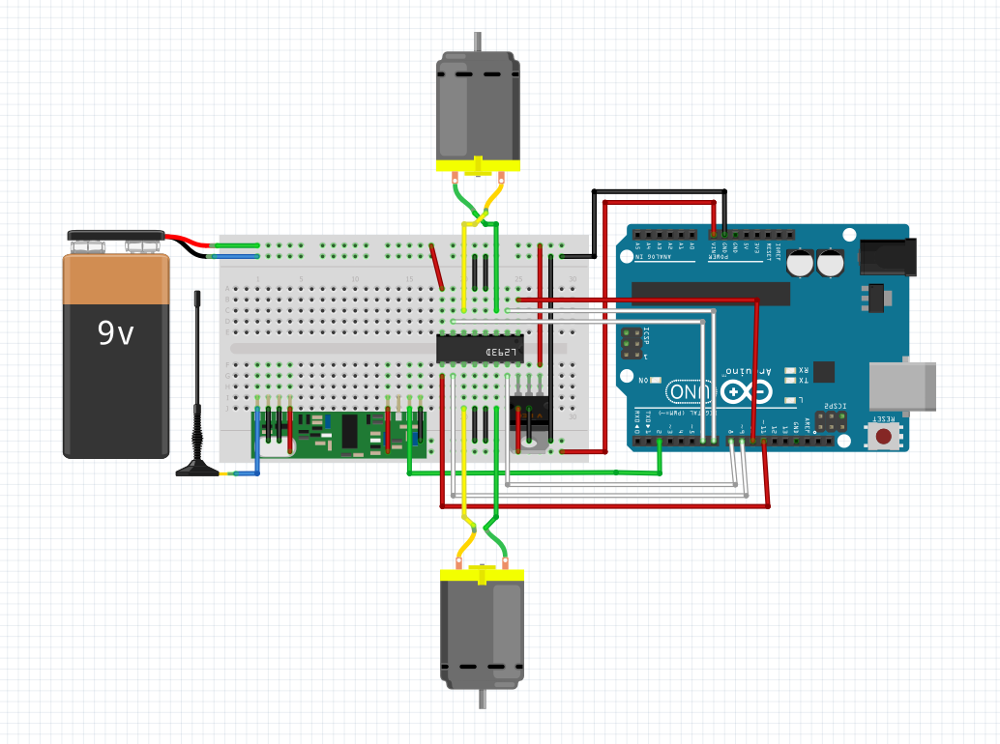
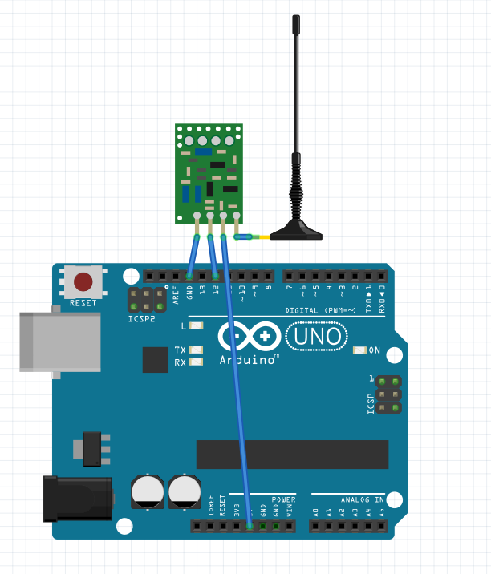

# Arduino Remote Car

<video controls width="100%" height="100%">
	Your Browser Does Not Support The Video Tag.
	<source src="videos/demo.mp4" type="video/mp4">
</video>

This Project is still under development.

This repository is the code base for the Arduino Car controlled remotely through ROS.

To run, load rx and tx to the arduinos with the respective hardware configurations.

Then install the ros package under arduino_rc_car and launch the controller.



## Parts Needed

- 2x [Arduino Uno](https://www.sparkfun.com/products/11021)
- Lots of Wires (preferably with different colors, at least red and black)
- [WRL-10532](https://www.sparkfun.com/products/10532)/[WRL-10534](https://www.sparkfun.com/products/10534) Radio Receiver/Transmitter Pair
- 1x Motor H-Bridge IC (I used L293D)
- 1x 5V Voltage Regulator (I used LM78M05C)
- 1x 9V Battery
- 2x DC Motors (I used [This](http://www.vigorprecision.com.hk/ProductList.Asp?SortID=1) just because they were available. The chassis is adapted to this model.)
- 1x small caster wheel (see CAD for dimensions)
- 2x bigger wheels (see CAD for dimensions)
- 1x half-size breadboard
- 2x antenna (I just used solid wires)
- Some zip ties if you want to provide cheap securing to your assembly

## Building the Chassis

Get the CAD from [here](https://drive.google.com/open?id=0B75j6bliWwyTUGZSWWZrYkl3Mnc).

The bulk of the chassis can be 3d printed.

In my case, I couldn't find a good caster wheel, so I 3d printed the wheel and mounted it with sheet metal.

As for the main wheel, I recommend buying them. The dimensions are specified in the CAD file.

## Wiring the components

### Receiver



The receiver is connected to the arduino.

### Transmittor



The transmitter should be connected to your computer.

## Software

1. Build the ros package to remotely control the arduino.
   ```bash
   export CATKIN_WORKSPACE=${HOME}/catkin_ws #REPLACE WITH YOUR OWN
   git clone git@github.com:yycho0108/ArduinoRemoteCar.git
   cp ArduinoRemoteCar/arduino_rc_car ${CATKIN_WORKSPACE}/src
   cd ${CATKIN_WORKSPACE}
   catkin_make --pkg arduino_rc_car
   ```

2. Install the arduino library [VirtualWire](https://www.pjrc.com/teensy/td_libs_VirtualWire.html) to facilitate RF communication.

   Here are [Instructions](https://www.arduino.cc/en/Guide/Libraries) on how to install an Arduino Library.

   Alternatively, simply run the following script: 

   ```bash
   export ARDUINO_SKETCH_DIR=${HOME}/sketchbook
   wget http://www.airspayce.com/mikem/arduino/VirtualWire/VirtualWire-1.27.zip
   unzip VirtualWire-1.27.zip
   mv VirtualWire ${ARDUINO_SKETCH_DIR}/libraries/VirtualWire
   ```

   If this fails, check your arduino sketchbook directory.

3. Install rosserial to communicate from your computer to the trasmitter. 

   ```bash
   export ARDUINO_SKETCH_DIR=${HOME}/sketchbook
   sudo apt-get install ros-indigo-rosserial-arduino
   sudo apt-get install ros-indigo-rosserial 
   cd ${ARDUINO_SKETCH_DIR}/libraries
   rm -rf ros_lib
   rosrun rosserial_arduino make_libraries.py 
   ```

## Running the code

1. Upload the code to receiver/transmitter arduinos.
2. Power up the car(connect the battery).
3. Connect the transmitter arduino to your computer via serial port.
4. Check the ports to which the transmitter is connected.

   ```bash
   ls /dev/ttyACM*
   ```

5. (Optional) To configure permission to access input devices without sudo permission,

   ```bash
   echo 'SUBSYSTEM=="input", MODE="660", GROUP="plugdev"' | sudo tee /etc/udev/rules.d/99-input.rules
   sudo usermod -a -G plugdev $(whoami)
   ```
	
5. Launch the ros control node.

   If you haven't configured access permission to input devices:

   ```bash
   sudo -s
   ```
   Otherwise, you don't need to become root.
  
   To launch the control node: 

   ```bash
   roslaunch arduino_rc_car control.launch port:=/dev/ttyACM0
   ```

6. Press the arrows to control the car remotely. 
